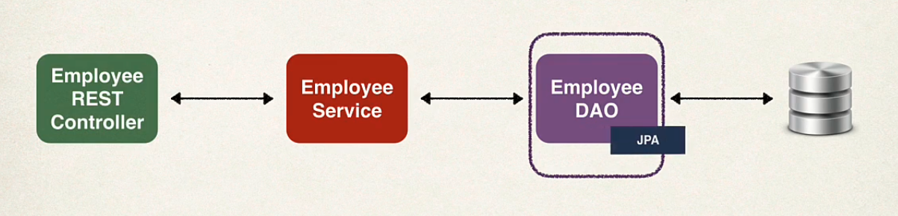
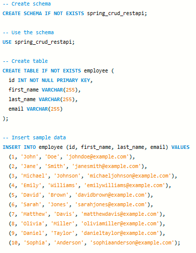

# REST API for Employee Management

This repository contains a REST API for managing employees. It provides endpoints for creating, reading, updating, and deleting employee records.

## Application Architecture



## Requirements

- Java 8 or higher
- Spring Boot
- Maven

## Installation

1. Clone the repository: `git clone https://github.com/JuanmaFranco/spring-mysql-rest-api.git`
2. Navigate to the project directory: `cd spring-mysql-rest-api`
3. Build the project: `mvn clean install`
4. Run the application: `mvn spring-boot:run`

The API will be accessible at `http://localhost:8080`.

## Schema and Data Setup

To prepare the database for testing the API, follow these steps:

1. Open MySQL Workbench or your preferred MySQL client.
2. Execute the schema-and-data.sql script located in the sql folder of the project. This script will create the necessary schema and populate the employee table with example data. Make sure you have appropriate permissions to create the schema and insert data.

    schema-and-data.sql:

    

3. Verify that the schema and data have been successfully created by running queries on the spring_crud_restapi schema.

## Endpoints

### Create Employee

- Method: `POST`
- URL: `/employees`
- Request body: JSON object representing the employee details

### Update Employee

- Method: `PUT`
- URL: `/employees/{id}`
- Request body: JSON object representing the updated employee details

### Delete Employee

- Method: `DELETE`
- URL: `/employees/{id}`

### Get Employee by ID

- Method: `GET`
- URL: `/employees/{id}`

### Get All Employees

- Method: `GET`
- URL: `/employees`

## Exception Handling

The application handles exceptions in a centralized manner using the `EmployeeExceptionHandler` class. It provides appropriate responses for different types of exceptions that may occur during API operations. The exception handling logic is as follows:

```java
@ControllerAdvice
public class EmployeeExceptionHandler {

    @ExceptionHandler
    public ResponseEntity<EmployeeErrorResponse> handleException(EmployeeNotFoundException employeeNotFoundException) {
        EmployeeErrorResponse response = new EmployeeErrorResponse();
        response.setStatusCode(HttpStatus.NOT_FOUND.value());
        response.setMessage(employeeNotFoundException.getMessage());
        response.setTimeStamp(System.currentTimeMillis());

        return new ResponseEntity<>(response, HttpStatus.NOT_FOUND);
    }

    @ExceptionHandler
    public ResponseEntity<EmployeeErrorResponse> handleException(Exception exception) {
        EmployeeErrorResponse response = new EmployeeErrorResponse();
        response.setStatusCode(HttpStatus.BAD_REQUEST.value());
        response.setMessage(exception.getMessage());
        response.setTimeStamp(System.currentTimeMillis());

        return new ResponseEntity<>(response, HttpStatus.BAD_REQUEST);
    }

}
```

The EmployeeExceptionHandler class uses the @ExceptionHandler annotation to define specific exception handling methods. If an EmployeeNotFoundException is thrown, the application returns a response with a "Not Found" status code (404) and the corresponding error message. For any other exceptions, a "Bad Request" status code (400) is returned along with the error message.

### Error Responses

When an exception is encountered, the API returns error responses in a JSON format. The error response includes the following details:

- Status Code: The HTTP status code indicating the nature of the error.
- Error Message: A descriptive message explaining the nature of the error.
- Timestamp: The timestamp indicating the date and time when the error occurred.

## Postman Collection

To simplify the testing and usage of this API, a Postman collection with pre-configured requests is provided.

### Prerequisites

Before using the Postman collection, make sure you have the following:

- Postman installed on your local machine. If you don't have Postman, you can download and install it from the official website: [Download Postman](https://www.postman.com/downloads/).

### Usage

To use the Postman collection, follow these steps:

1. Download the Postman collection file from the [Postman Collection](/postman/employee-api-collection.json) link.
2. Open Postman on your local machine.
3. Click on the "Import" button in the top left corner of the Postman interface.
4. Select the "Import File" option and choose the downloaded Postman collection file (`employee-api-collection.json`).
5. Once imported, you will see a new collection named "Employee API" in your Postman workspace.
6. Expand the collection to view the available requests and their descriptions.
7. Adjust the necessary parameters in the requests according to your environment.
8. You can now send requests to the API endpoints by clicking on the requests and selecting the desired HTTP method (GET, POST, PUT, DELETE).

## Contributing

Contributions are welcome! If you find any issues or would like to add new features, please open an issue or submit a pull request.